# Lab: Performing System Hardening

## 🔍 Scenario
In this applied lab, I worked on **system hardening** for Structureality Inc. across Windows and Linux systems.  
System hardening focuses on two key operations: **removing what isn’t needed** and **updating what is needed**.  
The challenge is iterative: update → remove → validate → repeat — which is exactly what we practiced.

## 🎯 Objectives
This lab aligns with CompTIA CySA+ objectives:
- **1.1**: Explain the importance of system and network architecture concepts in security operations  
- **2.5**: Explain concepts related to vulnerability response, handling, and management  

## 🧰 Tools & Environment
- **KALI Linux** (Debian-based, penetration testing build)  
- **DC10** (Windows Server 2019, Domain Controller)  
- **MS10** (Windows Server 2016)  
- **PC10** (Windows Server 2019 client)  
- Tools: Bash, Nano, wget, Windows CMD, Server Manager, Windows Defender Firewall  

---

## 🛠 Key Steps Performed

### 1. Managing Device Drivers (Windows Server)
System hardening begins with checking and maintaining device drivers to ensure no outdated/insecure components remain.

- Opened **Device Manager** and scanned for hardware changes.  
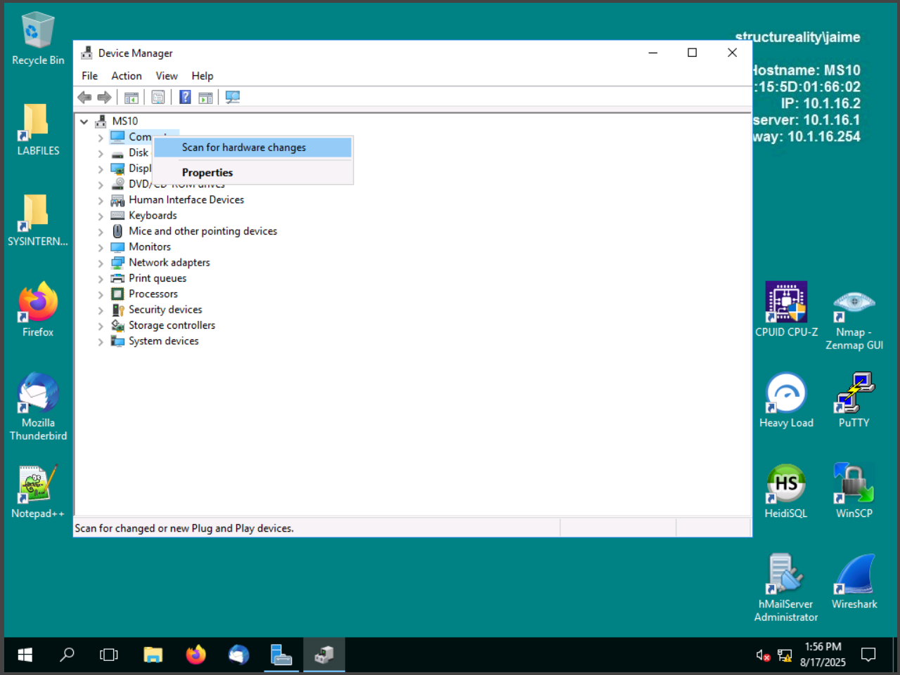  

- Verified that the **CD-ROM driver** was already up-to-date.  
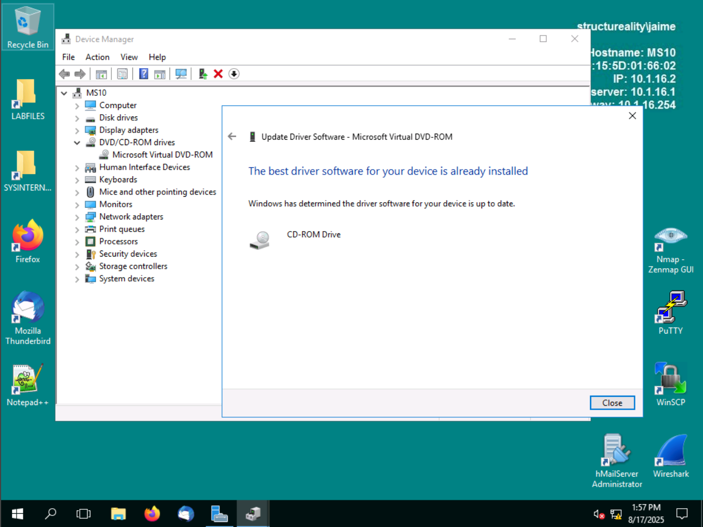  

---

### 2. Manipulating Hosts File Resolution (Linux)
Edited `/etc/hosts` to control FQDN resolution — blocking, redirecting, and restoring correct resolution.

- Verified resolution with `wget` and checked current `/etc/hosts`.  
  

- Introduced a **false entry** using nano.  
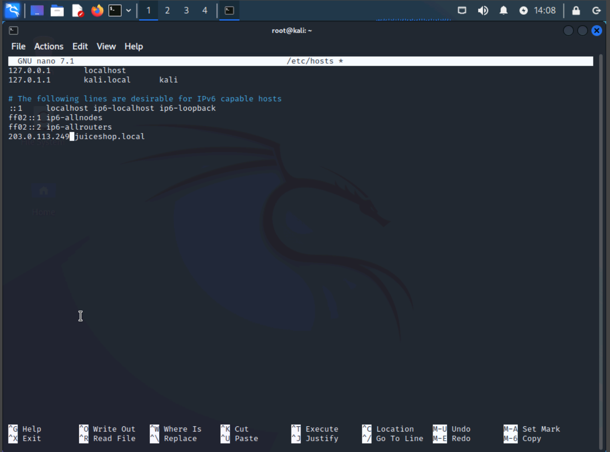  

- Tested false resolution — connection failed due to wrong mapping.  
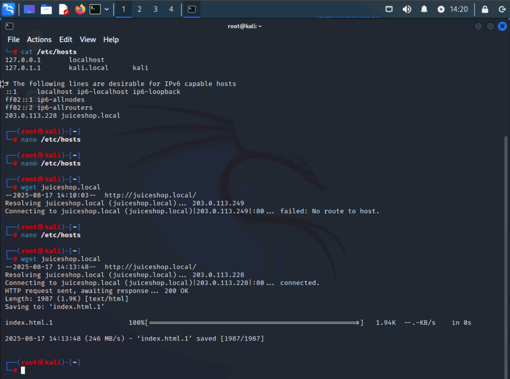  

- Restored the correct mapping to 203.0.113.228 → resolution succeeded.  
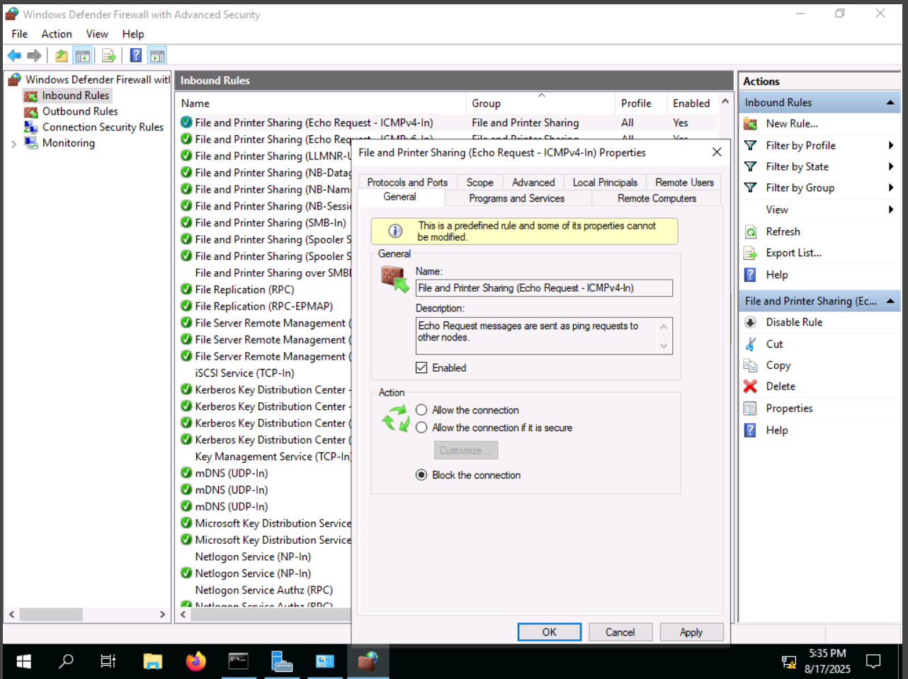  

---

### 3. Removing Unneeded Applications and Services (Windows Server)
Eliminating unused software and insecure services reduces attack surface.

- Uninstalled **CPUID CPU-Z** via Programs and Features.  
  

- Launched **Remove Roles and Features Wizard**.  
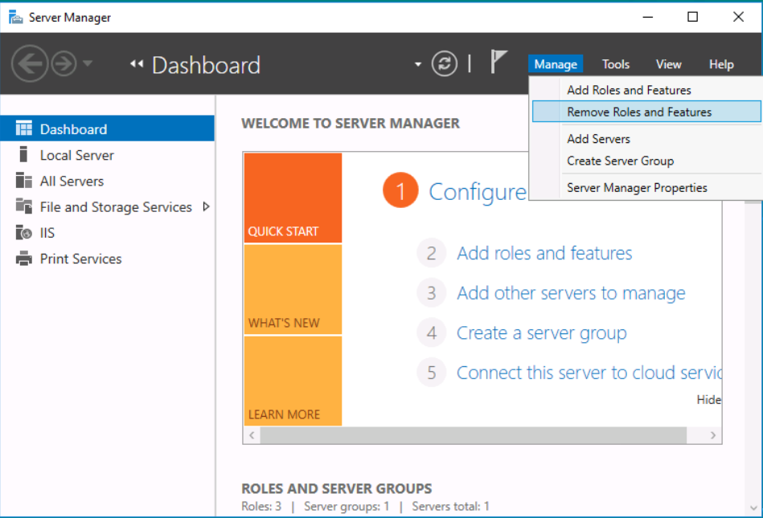  

- Removed the **FTP Server** role and service.  
  

---

### 4. Applying Firewall Rules (Windows Firewall with Advanced Security)
Restricted ICMP traffic to enforce security baselines.

- **Before hardening**: PC10 successfully pinged DC10.  
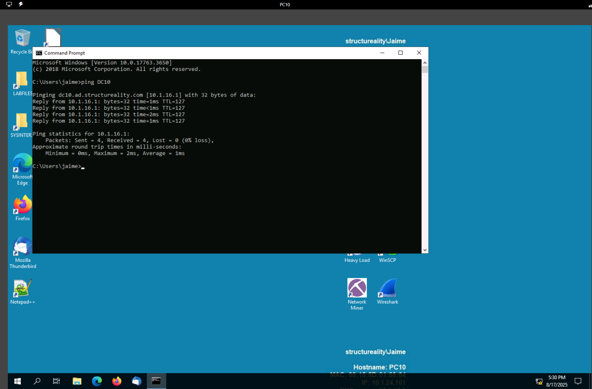  

- Configured inbound rules to **explicitly block ICMP Echo Requests**.  
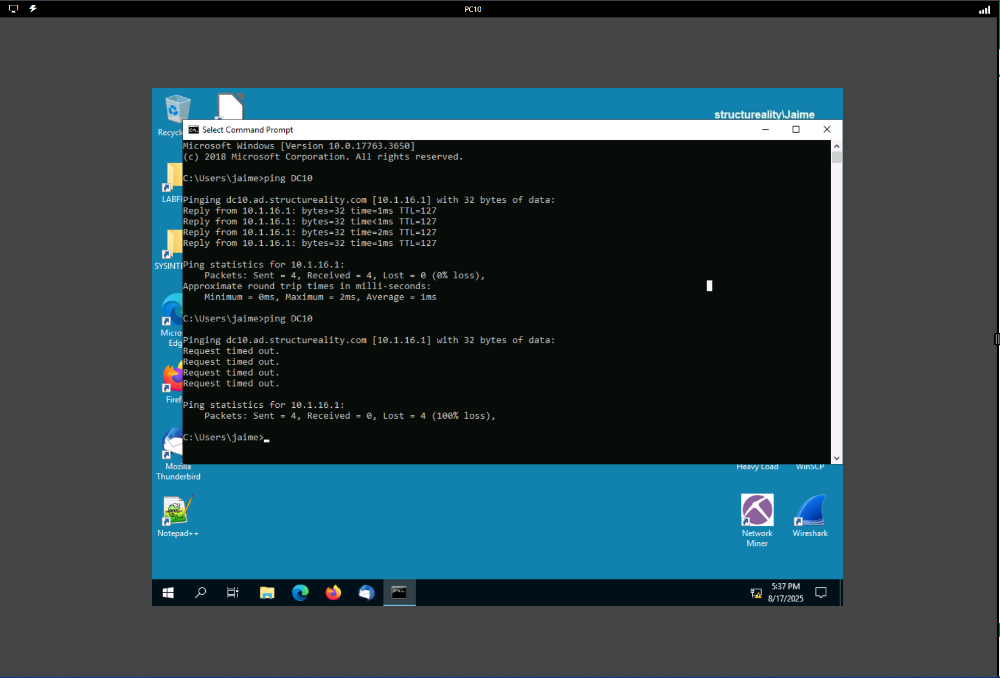  

- **After hardening**: ping requests from PC10 to DC10 timed out.  
  
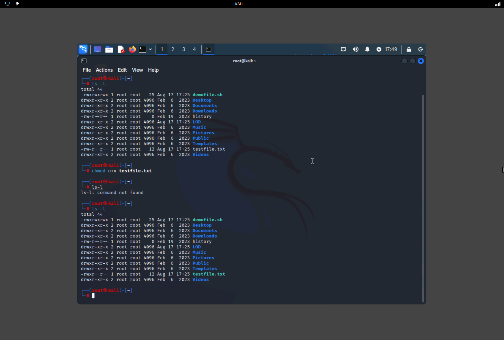  

---

### 5. Setting File Permissions (Linux)
Applied secure file permissions using both symbolic and octal notation.

- Applied `chmod 710 demofile.sh` → limited to owner full access, group execute, no access for others.  
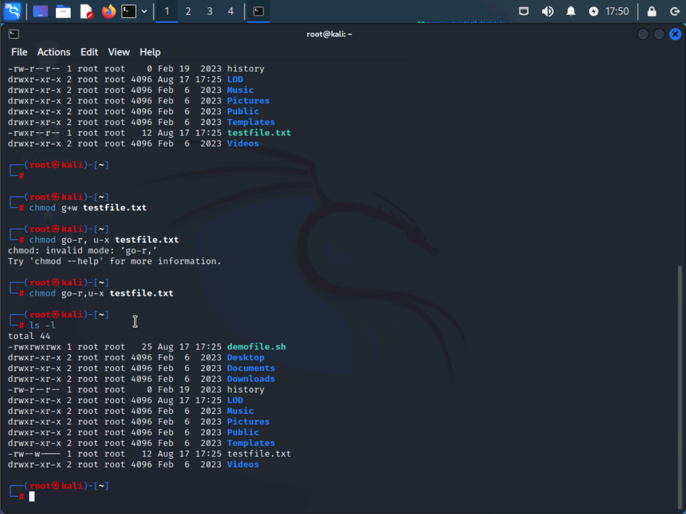  

- Practiced symbolic notation (`u+x`, `g+w`, `go-r,u-x`) on **testfile.txt**.  
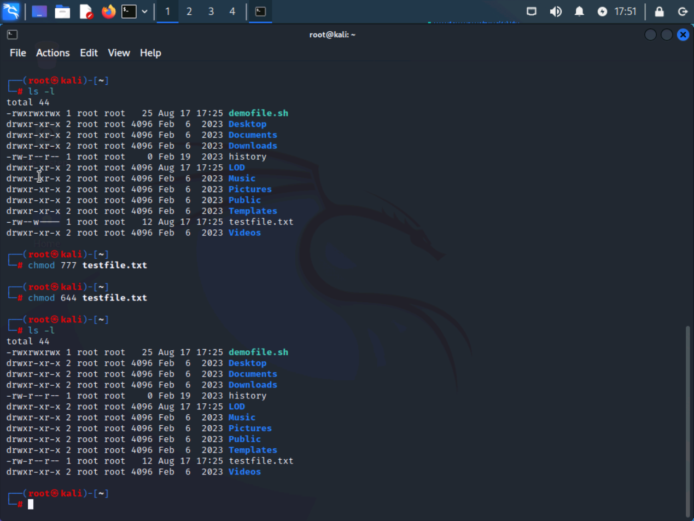  

- Practiced octal notation (`777`, `644`) to reset permissions.  
  

---

## 📸 Full Screenshot Walkthrough
All 16 screenshots are included in `./screenshots/` with contextual captions above.

---

## 🧠 Lessons Learned
- **Hardening is iterative**: update → remove → validate → repeat.  
- Hosts file manipulation shows how easily DNS can be overridden.  
- Removing unused software/services immediately reduces vulnerabilities.  
- **Firewall best practice**: use explicit **deny rules**, not just disabling allows.  
- Linux file permissions are foundational for controlling confidentiality, integrity, and availability.  

---

✅ **Relevance to Career**  
This lab demonstrates practical SOC analyst and GRC skills:  
- Applying security baselines across platforms  
- Documenting and validating changes  
- Connecting hardening techniques to compliance and operational security  
