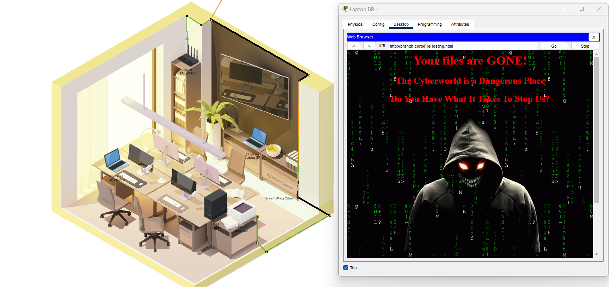
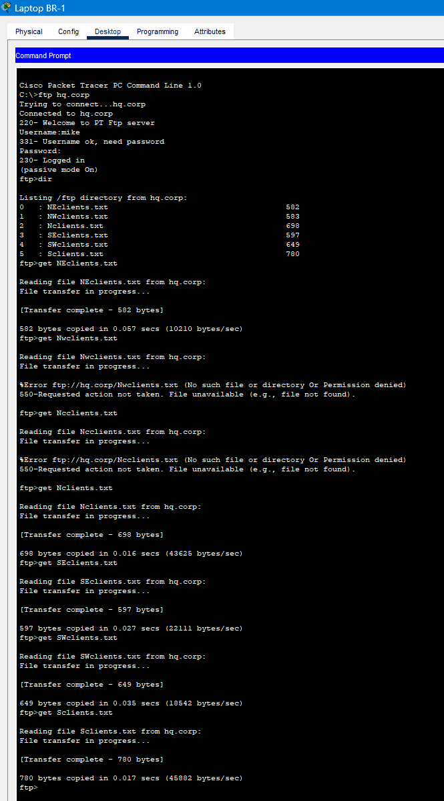
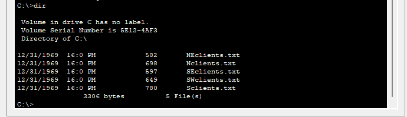
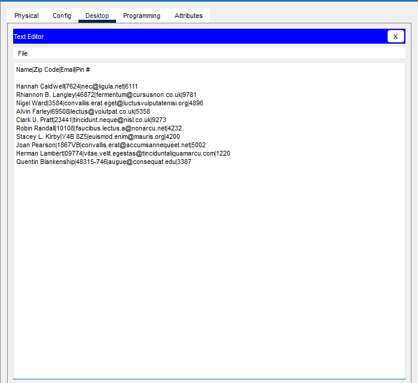
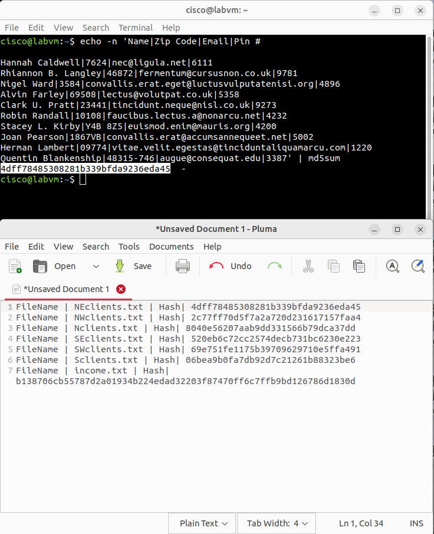
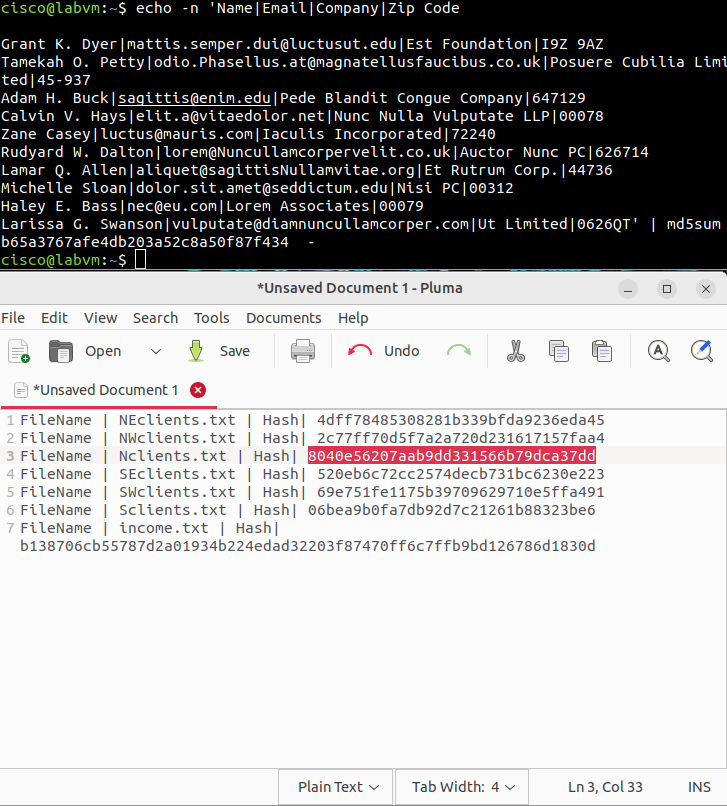
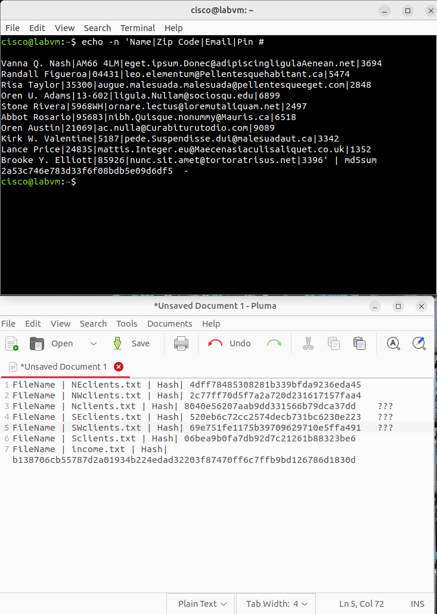
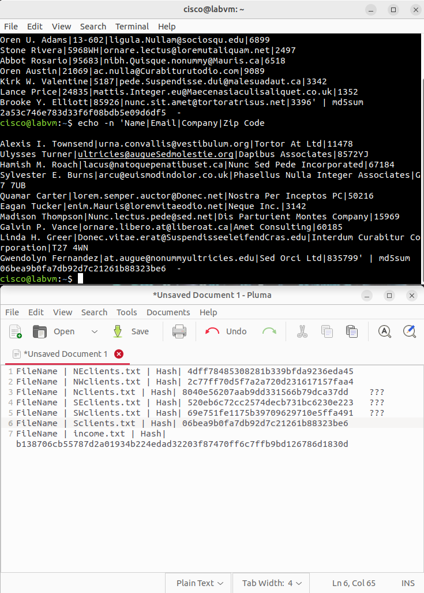
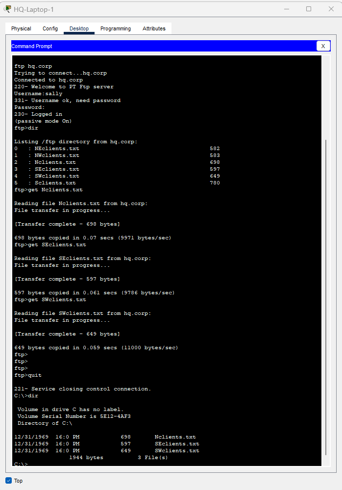
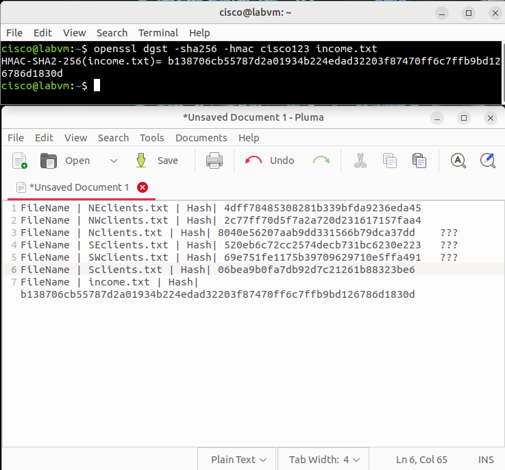

# Lab01 — Incident Response: File & Data Integrity Checks (Simulation)

**Who I am in this lab:** I’m acting as “Mike,” the branch IT/SOC analyst responding to a suspected ransomware incident.  
**Environment:** 100% virtual — Cisco Packet Tracer network + Ubuntu CSE‑LABVM (no real data).  
**Goal:** Treat this like a real case: confirm the breach, preserve evidence, verify integrity (hash/HMAC), and recommend controls.

---

## 📝 What happened (story)
Our branch users reported a scary ransomware‑style screen. Management suspected client files were stolen or changed.  
I took point on the response: grab baselines, pull copies from HQ, verify each file’s integrity, validate the finance file with HMAC‑SHA256, and document everything cleanly.

> This is a simulation, but I follow the **actual** IR flow: triage → collect evidence → analyze → report → recommend.

---

## 🎯 Objectives
- Reconstruct what happened and **prove** which files changed.
- Use **MD5** for quick integrity checks and **HMAC‑SHA256** for authenticity on critical data.
- Show why **FTP** is a problem and how to fix that class of risk.
- Produce an IR‑style write‑up with screenshots/evidence.

---

## 🧰 Tools & Commands
- Packet Tracer (network + endpoints), Ubuntu CSE‑LABVM (analysis box)  
- `md5sum` for hashing  
- `openssl dgst -sha256 -hmac <key>` for HMAC  
- FTP client (intentionally insecure in the lab to demonstrate risk)

---

## 🔍 Investigation (in order of evidence)

### 1) Quick authenticity check on a critical finance file (HMAC)
Before touching anything else, I validated the finance file (`income.txt`) with **HMAC‑SHA256** to prove integrity **and** authenticity using a shared secret.
  


---

### 2) User‑facing impact at the branch — ransomware/defacement
This is what kicked off the incident: the workstation showed a ransomware‑style message. I treated the host as compromised and focused on integrity + exfiltration impact.



---

### 3) Pulling client files (lab uses FTP to illustrate the risk)
Per the exercise, I retrieved six regional client files from HQ using **FTP** (insecure by design here). In the real world, this should be **SFTP/FTPS** with authN + encryption.



---

### 4) Sanity check on what landed locally
Confirmed what I actually pulled down so I could hash locally and compare to HQ baselines.



---

### 5) Why this matters — a peek at the client data
Even in a lab, you can see why integrity matters: the files look like they contain PII/contacts. If altered/exfiltrated, this becomes a real disclosure risk.



---

### 6) Follow‑up HMAC/hash verification on branch artifacts
Ran additional checks so I could separate good vs. altered files with evidence.



---

### 7) Hash comparison — NW clients (baseline vs current)
This one matched baseline (no tampering).



---

### 8) Hash comparison — SE clients (mismatch → altered)
Mismatch confirmed: the SE file did not match the HQ baseline.



---

### 9) Hash comparison — SW clients (mismatch → altered)
Another mismatch; SW file integrity failed.



---

### 10) HQ side confirmation (same weak protocol path)
Also validated that the same insecure transfer path existed at HQ, which explains how easy tampering/exfiltration would be in a real environment.



---

## ✅ Findings
- **Altered:** `Nclients.txt`, `SEclients.txt`, `SWclients.txt`
- **Unaffected:** `NEclients.txt`, `NWclients.txt`, `Sclients.txt`
- **Finance file:** `income.txt` **HMAC‑verified** (authentic + intact)
- **Root cause pattern:** unencrypted FTP increased exposure to tampering/exfiltration

---

## 🧠 Lessons I’m taking forward
- Keep a **baseline hash inventory** for critical data (store it safely).
- Use **HMAC** (or signatures) when authenticity matters, not just MD5/SHA.
- Kill **FTP**; enforce **SFTP/FTPS** with proper auth and TLS.
- Centralize logs to a **SIEM** and monitor for integrity anomalies.
- Practice evidence capture and clear reporting — it saves time under pressure.

---

## 📦 Artifacts
- `./screenshots/` — numbered in investigation order (01 → 10)  
- [`evidence_hashes.txt`](./evidence_hashes.txt) — optional notes table for baseline vs current hashes (SAFE/ALTERED)

---

## 🔧 Commands I used (representative)
```bash
# Quick MD5 against pasted content (from Packet Tracer text)
echo -n '<file-contents>' | md5sum

# HMAC-SHA256 for a sensitive file (proves integrity + authenticity)
openssl dgst -sha256 -hmac cisco123 income.txt
