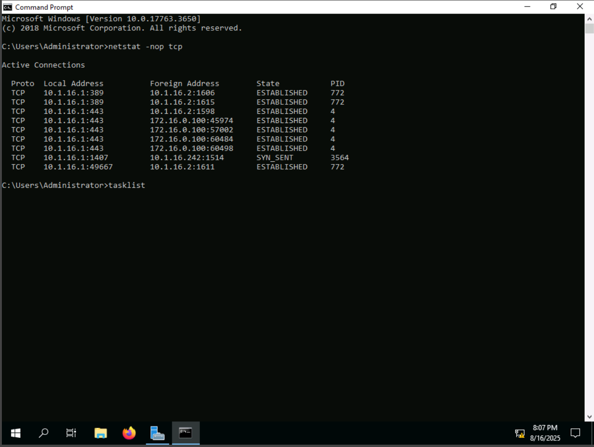
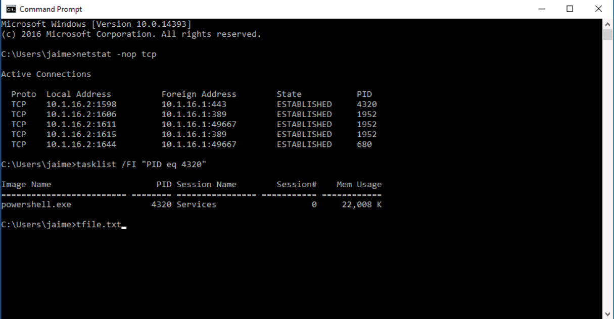
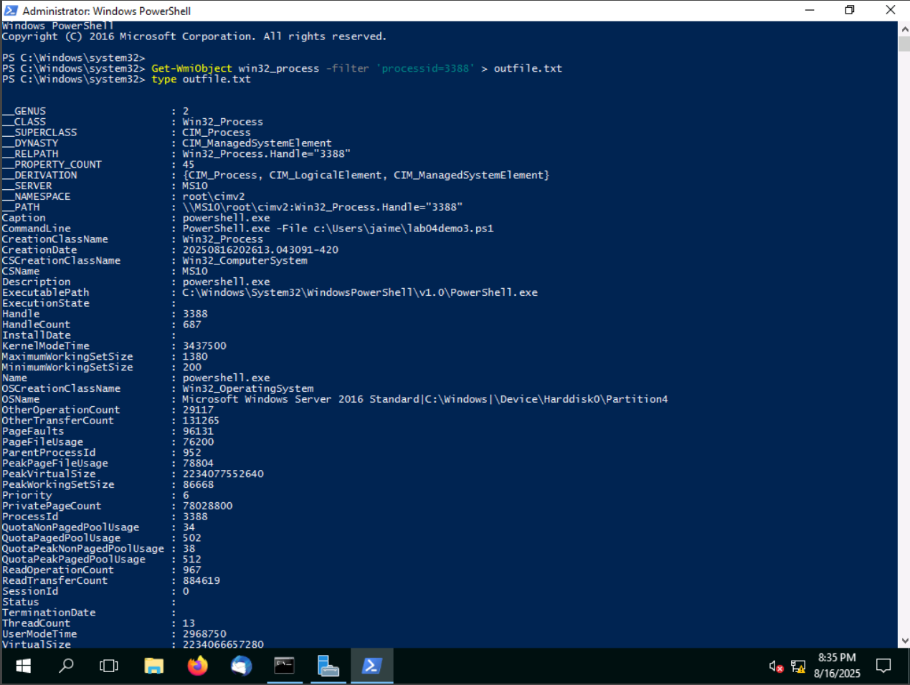
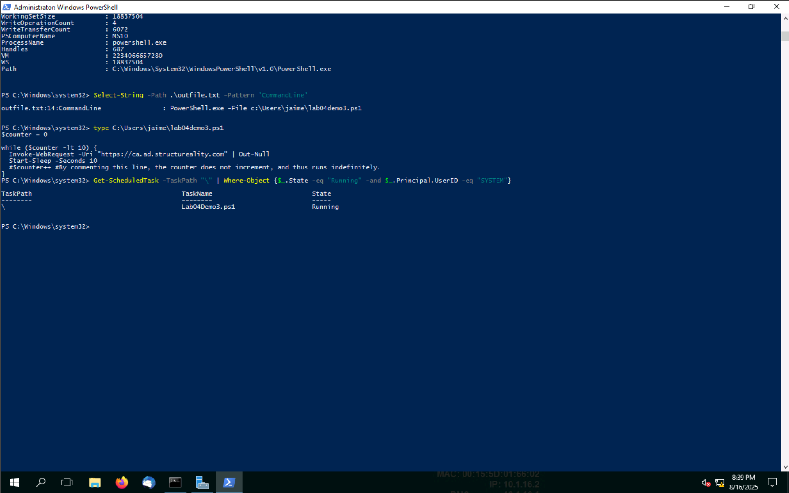
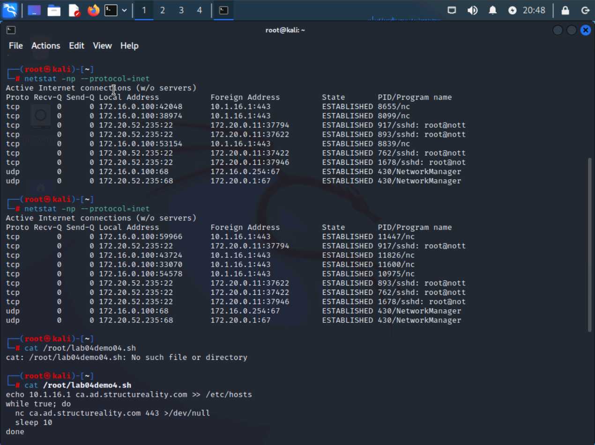
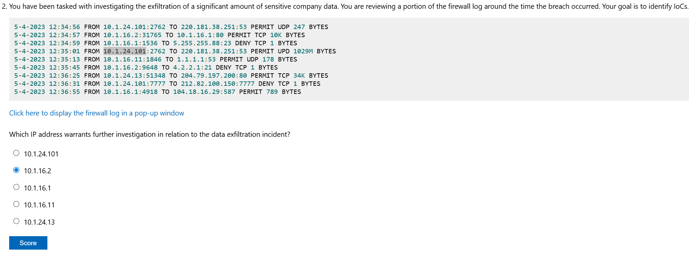
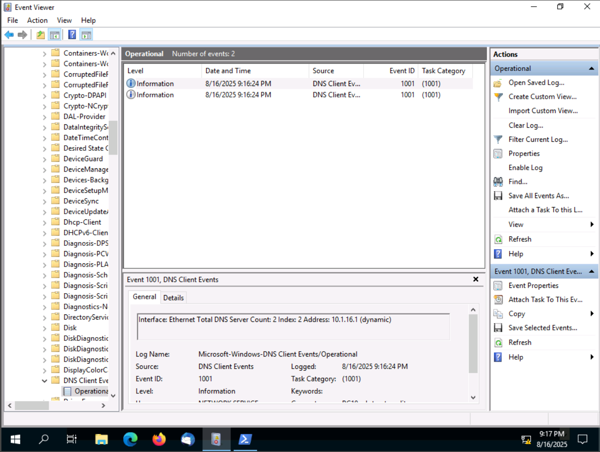
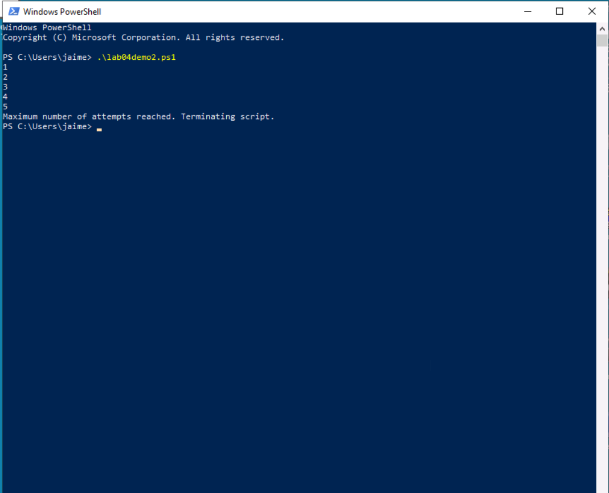
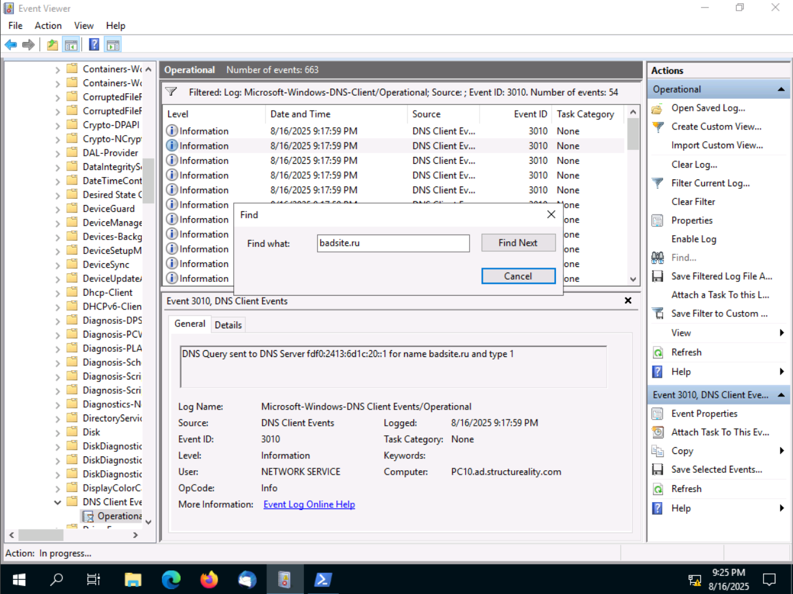

# Lab03 – Threat Hunting Investigation

## Introduction
This lab simulates a **real-world threat hunting scenario** where a security analyst investigates suspicious activity across multiple data sources. The exercise demonstrates how to uncover evidence of intrusion, persistence mechanisms, and **data exfiltration** by correlating logs, host-based artifacts, and network traffic.  

Threat hunting goes beyond waiting for automated alerts — it requires **active hypothesis-driven investigation** to detect Indicators of Compromise (IoCs) that adversaries attempt to conceal.  

By completing this lab, I demonstrated the ability to:  
- Analyze **Windows Event Viewer logs** for DNS anomalies.  
- Investigate **PowerShell execution and persistence mechanisms**.  
- Use **Linux tools** to analyze attacker scripts and outbound connections.  
- Review **firewall logs** to confirm data exfiltration attempts.  
- Correlate host- and network-based artifacts to reconstruct the attack chain.  

---

## Objectives
The investigation was structured around four main objectives:  

1. **Identify suspicious DNS activity** pointing to possible command-and-control (C2) communication.  
2. **Examine PowerShell activity** on endpoints for evidence of execution and persistence.  
3. **Analyze Linux netstat results and attacker scripts** to confirm malicious connectivity.  
4. **Correlate findings with firewall logs** to confirm data exfiltration and the responsible internal IP.  

---

## Lab Environment
The lab was conducted in a controlled training environment that mirrored a realistic SOC investigation.  

- **Windows 10 Endpoint**  
  - Tools: Event Viewer, PowerShell  
  - Focus: DNS logs, script execution, scheduled tasks  

- **Linux (Kali) Environment**  
  - Tools: `netstat`, script inspection  
  - Focus: Malicious connectivity and exfiltration scripts  

- **Firewall Logs**  
  - Focus: Detection of outbound data exfiltration  

---

## Tools & Techniques
- **Windows Event Viewer** (Event IDs: 1001 – DNS assignment, 3010 – DNS queries)  
- **PowerShell Analysis** (script execution, scheduled task persistence)  
- **Linux Command-Line** (`netstat`, reviewing malicious `.sh` scripts)  
- **Firewall Log Review** (traffic correlation with suspected exfiltration host)  
- **Threat Hunting Process**  
  - Hypothesis → Investigation → Correlation → Confirmation  

---

## Investigation Walkthrough

The threat hunting process was conducted in a structured sequence, guided by the lab instructions. Each stage provided key insights into attacker behavior.  

---

### 🔎 Step 1 – Firewall Reconnaissance Detection  
- **Action**: Reviewed firewall logs for scanning attempts from a suspected attacker machine (Kali).  
- **Finding**: Evidence of network scans targeting multiple internal systems was logged, confirming reconnaissance activity from an external adversary.  
- **Screenshot 1**: Firewall log entries showing packet captures from the scanning host.  

---

### 🔎 Step 2 – Windows DNS Client Events (Event ID 1001 & 3010)  
- **Action**: Investigated **DNS Client logs** in Windows Event Viewer.  
  - Event ID **1001** showed assignment of DNS servers.  
  - Event ID **3010** revealed DNS queries made by the host.  
- **Finding**: Queries to suspicious domains such as `badsite.ru` were uncovered.  
- **Screenshot 2**: Event Viewer filtered to Event ID 3010.  
- **Screenshot 3**: Event ID 1001 showing assigned DNS server (10.1.16.1).  
- **Screenshot 4**: Query to malicious domain `badsite.ru`.  

---

### 🔎 Step 3 – PowerShell Execution Analysis  
- **Action**: Executed suspicious PowerShell scripts provided in the environment (`lab04demo2.ps1`, `lab04demo3.ps1`).  
- **Finding**:  
  - Script `lab04demo2.ps1` repeatedly attempted connections until termination.  
  - Script `lab04demo3.ps1` demonstrated persistence behavior by scheduling tasks.  
- **Screenshot 5**: Execution of `lab04demo2.ps1` showing connection attempts.  
- **Screenshot 6**: Evidence of malicious PowerShell activity from scheduled tasks (`lab04demo3.ps1`).  

---

### 🔎 Step 4 – Linux Network Forensics (Kali)  
- **Action**: On the Linux machine, used `netstat -np` to identify live malicious connections.  
- **Finding**: Multiple connections to external IPs (`10.1.16.1:443`, `10.1.16.11:37622`) confirmed command-and-control (C2) channels.  
- **Screenshot 7**: Netstat output showing persistent established connections.  
- **Screenshot 8**: Review of `Lab04demo4.sh` script revealing automated outbound exfiltration to `ca.ad.structurereality.com` over port 443.  

---

### 🔎 Step 5 – Firewall Exfiltration Logs  
- **Action**: Correlated host findings with **firewall logs** to confirm large-scale data exfiltration.  
- **Finding**: IP `10.1.16.2` was identified as the primary source of exfiltration traffic, transferring large amounts of data out of the network.  
- **Screenshot 9**: Firewall log snippet highlighting outbound transfer from `10.1.16.2`.  
- **Screenshot 10**: Analyst confirmation question identifying `10.1.16.2` as the IoC for exfiltration.  

---

### 🔎 Step 6 – Consolidation of Indicators of Compromise (IoCs)  
By the end of the investigation, multiple IoCs were identified across host and network layers:  
- Suspicious DNS queries: `badsite.ru`  
- Malicious PowerShell scripts: `lab04demo2.ps1`, `lab04demo3.ps1`  
- Attacker persistence: Scheduled tasks via PowerShell  
- Malicious Linux script: `Lab04demo4.sh`  
- Malicious outbound host: `10.1.16.2` (responsible for exfiltration)  

**Screenshots 11–16** provide supporting evidence of IoCs and analyst validation steps.  

---

## Findings & Lessons Learned

This lab reinforced the **importance of proactive threat hunting** in uncovering adversary activity that may bypass automated defenses.  

Key takeaways:  
- **DNS anomalies are early warning signs** – monitoring Event IDs 1001 and 3010 can uncover suspicious domains.  
- **PowerShell remains a powerful attacker tool** – scripts often enable persistence and lateral movement.  
- **Linux logs and scripts reveal attacker methodology** – outbound exfiltration scripts are a common final step.  
- **Firewall correlation is critical** – only by tying endpoint events with network logs was the exfiltrating host (`10.1.16.2`) confirmed.  
- **Documenting IoCs ensures actionable intelligence** – findings can feed into SIEM/SOAR for automation in real-world SOCs.  

This exercise highlighted how a defender must **connect host-based forensics, network telemetry, and attacker TTPs** to build the full kill chain.

---

## Screenshot Reference Table

| # | Step | Description | Screenshot |
|---|------|-------------|------------|
| 1 | Firewall Recon | Firewall logs capturing scanning attempts from attacker host |  |
| 2 | DNS Analysis | Event Viewer – filtering DNS logs by Event ID 3010 |  |
| 3 | DNS Analysis | Event ID 1001 showing DNS server assignment |  |
| 4 | DNS Analysis | Suspicious query to malicious domain `badsite.ru` |  |
| 5 | PowerShell Analysis | Execution of `lab04demo2.ps1` showing repeated outbound attempts |  |
| 6 | PowerShell Persistence | Scheduled task activity linked to `lab04demo3.ps1` |  |
| 7 | Linux Netstat | Established malicious connections (C2 channels) |  |
| 8 | Linux Script Review | Malicious exfiltration script `Lab04demo4.sh` targeting external domain |  |
| 9 | Firewall Exfil | Firewall log snippet showing outbound data from `10.1.16.2` |  |
| 10 | Analyst Validation | Confirmation step – identifying exfiltrating host |  |
| 11 | IoC Collection | Documenting suspicious DNS IoCs |  |
| 12 | IoC Collection | Identifying malicious PowerShell script activity |  |
| 13 | IoC Collection | Correlation of Linux persistence and exfiltration artifacts |  |
| 14 | IoC Collection | Firewall logs cross-checked with host evidence |  |
| 15 | Final Confirmation | Analyst answering final lab validation questions |  |
| 16 | Investigation Closure | Wrap-up of IoCs and attack chain confirmation |  |

---

## Final Summary

This lab simulated a **multi-stage intrusion** and required connecting evidence across different platforms. By progressing step-by-step and validating findings with multiple data sources, I was able to:  

- Detect **initial reconnaissance and malicious DNS activity**.  
- Identify **PowerShell persistence mechanisms**.  
- Confirm **C2 and exfiltration traffic from Linux and firewall logs**.  
- Deliver a structured **IoC list and validated attack chain**.  

This mirrors real-world SOC workflows where **analysts must piece together fragmented signals into a coherent narrative** of the attack.  

