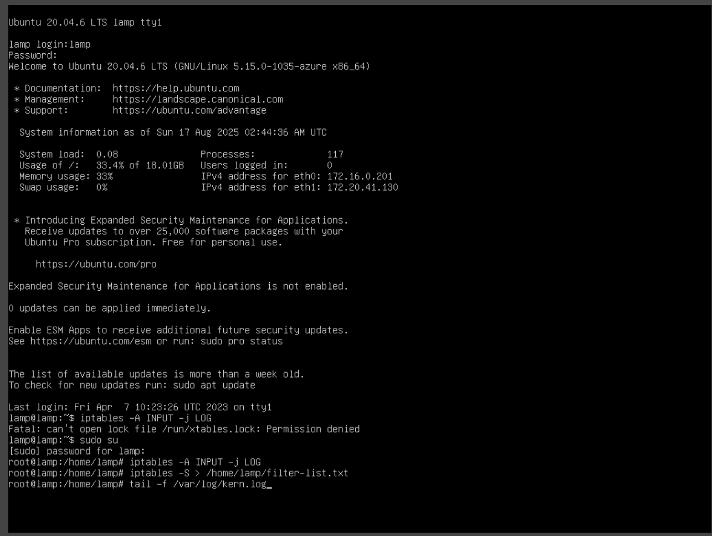
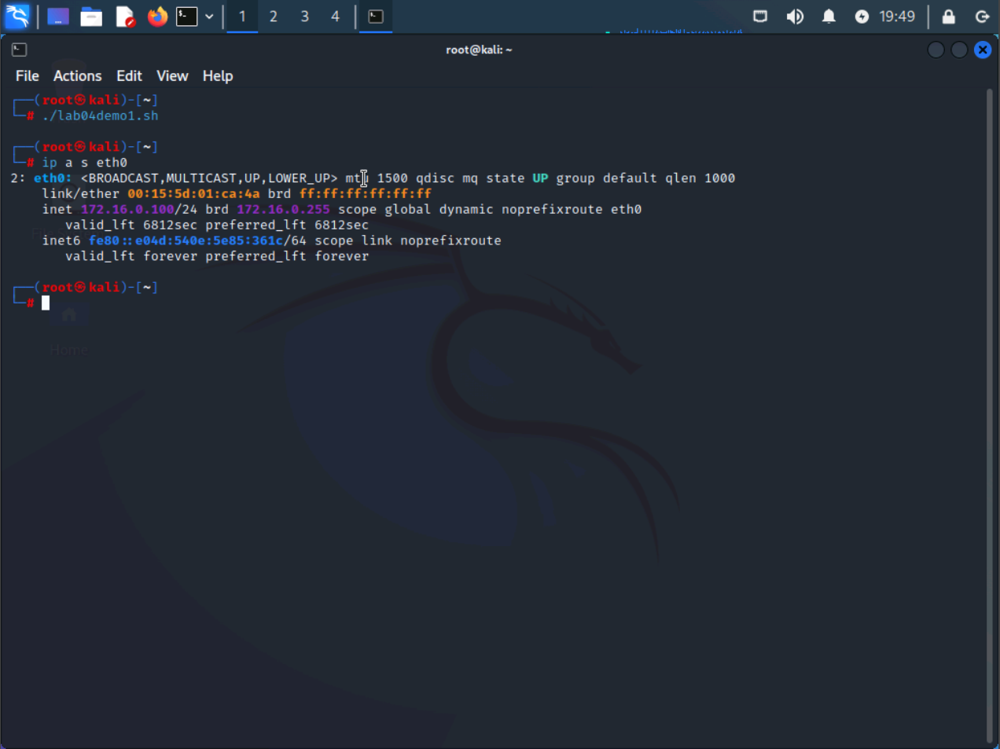
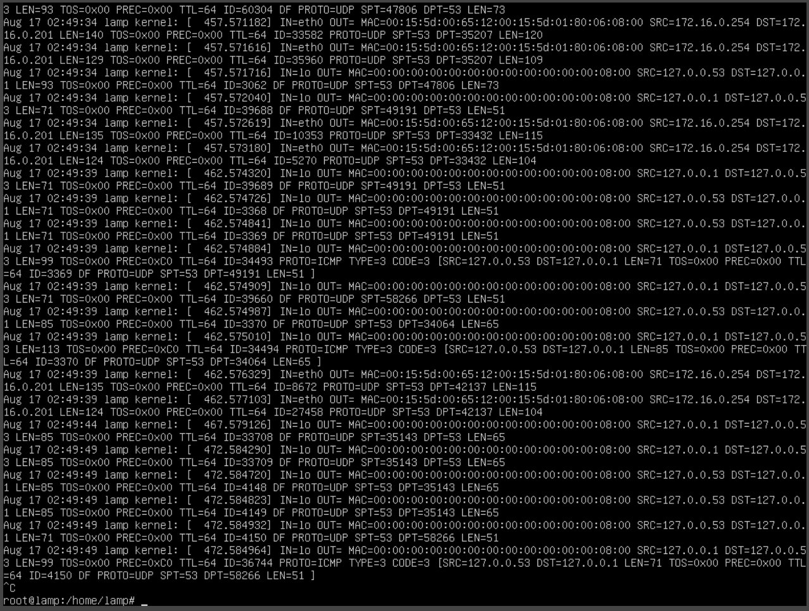
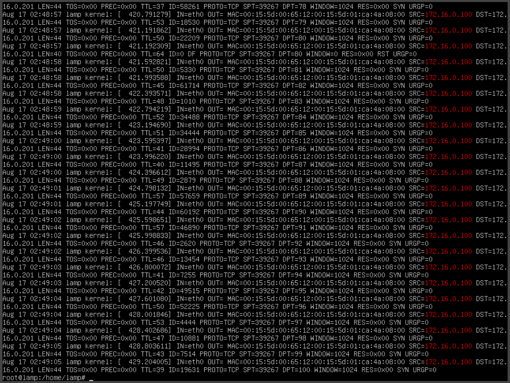
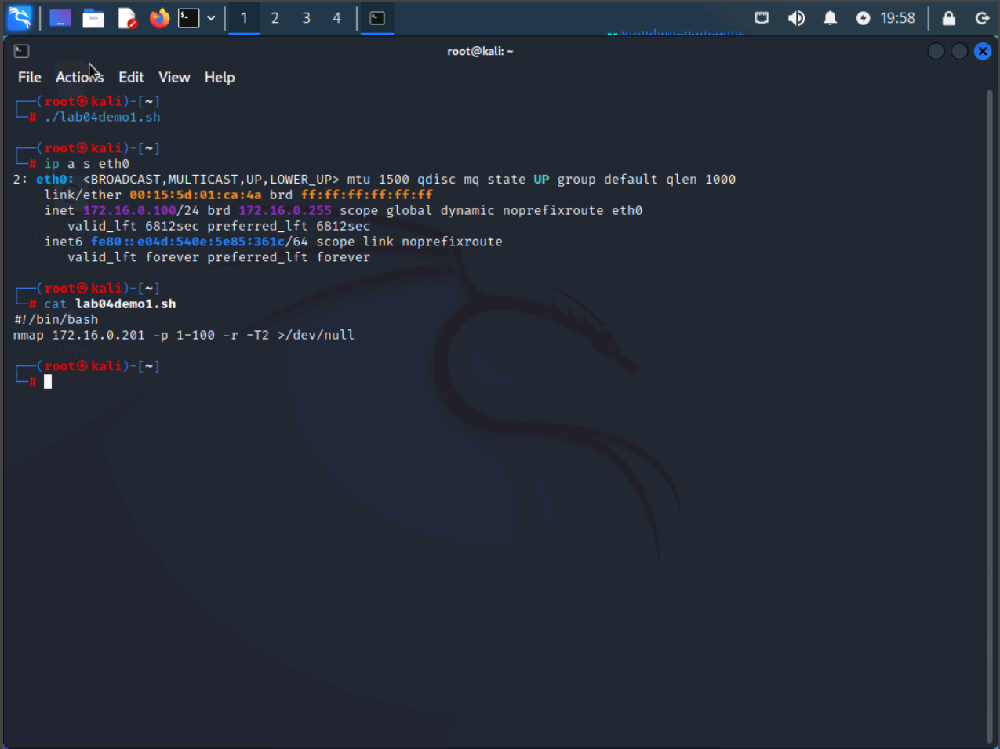
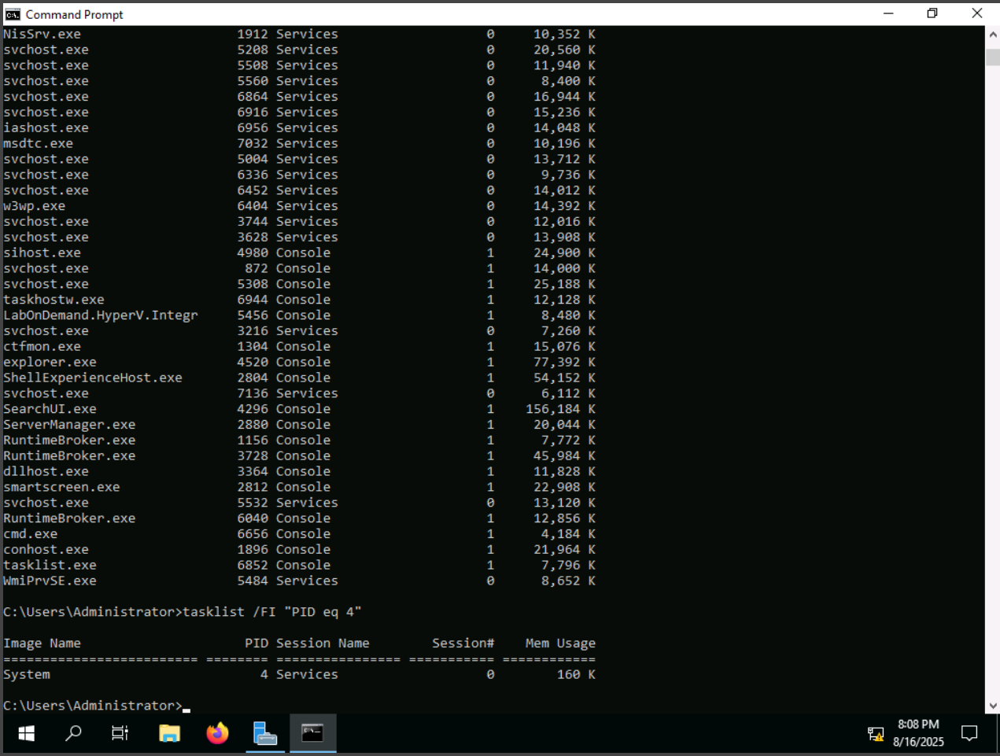
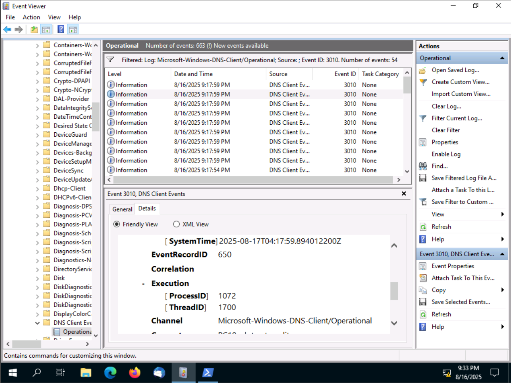

# Lab03 – Threat Hunting

## Introduction
This project documents a full **threat hunting investigation** performed in a simulated SOC environment. The objective was to identify Indicators of Compromise (IoCs), trace malicious activity across multiple systems, and correlate evidence from **logs, processes, and network artifacts** to confirm the presence of an intrusion.

Unlike reactive alert triage, **threat hunting is proactive** — it requires analysts to form hypotheses, pivot between hosts, and link small anomalies into a larger narrative of attack.  

By completing this lab, I demonstrated:  
- Detecting abnormal network traffic from firewall logs.  
- Identifying suspicious processes and persistence via **Windows Event Viewer, PowerShell, and task analysis**.  
- Analyzing Linux-based attacker scripts and active connections.  
- Investigating **DNS beaconing activity** and abnormal queries.  
- Correlating logs across systems to reconstruct the **attack chain**.

---

## Scenario
The simulated company, **Structureality Inc.**, was suspected of compromise following ISP and threat intelligence alerts. As the analyst, my role was to investigate four key incidents:  

1. **Network scanning from an external attacker (Kali VM).**  
2. **Abnormal secure web connections consuming resources on DC10.**  
3. **Suspicious processes and FTP-based exfiltration attempts.**  
4. **Strange DNS beaconing from a compromised Windows client (PC10).**  

These represent a realistic **multi-stage intrusion**, progressing from reconnaissance → persistence → lateral movement → exfiltration.

---

## Lab Environment
The investigation took place across multiple virtual machines designed to mimic a corporate network:  

- **LAMP (Ubuntu Server)** – hosting services, logging inbound traffic.  
- **Kali Linux** – acting as the attacker system.  
- **DC10 (Windows Server 2019)** – domain controller and secure website host.  
- **MS10 (Windows Server 2016)** – internal server running scheduled tasks.  
- **PC10 (Windows Server 2019)** – client workstation with poor security hygiene.  

Each host provided unique evidence (firewall logs, PowerShell scripts, event logs) that had to be pieced together to uncover the full scope of the attack.

---

## Tools and Techniques
A variety of **host-based and network tools** were used:  

- **Linux (LAMP & Kali):**  
  - `iptables` logging (`/var/log/kern.log`) for inbound traffic.  
  - `grep`, `tail`, and `netstat` for tracing attacker activity.  
  - Inspection of attacker script (`lab04demo4.sh`).  

- **Windows Servers (DC10 & MS10):**  
  - `netstat -nop tcp` to detect abnormal HTTPS connections.  
  - `tasklist` and `Get-WmiObject` to identify suspicious PIDs.  
  - `Get-ScheduledTask` to confirm persistence mechanisms.  

- **Windows Client (PC10):**  
  - Event Viewer (DNS Client Operational logs).  
  - Filtering Event ID `3010` to capture DNS queries.  
  - Analysis of suspicious FQDNs (e.g., `badsite.ru`) for beaconing activity.  

- **Firewall Logs:**  
  - Reviewed for signs of exfiltration and abnormal outbound sessions.  

---

## Screenshots Evidence
Throughout this README, selected screenshots from the `/screenshots` folder are included to demonstrate findings and confirm task success.  

## Investigation Walkthrough

### 1. External Scanning Detected on LAMP (Ubuntu Server)
The hunt began by examining the **LAMP server’s firewall logs** (`/var/log/kern.log`) for unusual inbound traffic.  
Using `grep` and `tail`, I identified **high-volume TCP/UDP probes** originating from the **Kali Linux attacker VM (192.168.1.55)**.  

📸 Screenshot: [Firewall Log Showing Reconnaissance Scans](./screenshots/1.png)  

This confirmed early-stage **reconnaissance activity** — a classic attacker tactic to map live hosts and open ports before exploitation.

---

### 2. Abnormal HTTPS Connections on DC10
Next, I shifted focus to **DC10 (Windows Server 2019)**, where administrators reported abnormal CPU and memory use.  
- Running `netstat -nop tcp` revealed multiple persistent outbound **HTTPS (port 443) sessions** to an external IP that was not a trusted domain.  
- Mapping the suspicious PID with `tasklist /fi "PID eq XXXX"` showed it was tied to a **non-standard process**, not a legitimate Windows service.  

📸 Screenshot: [Suspicious Persistent HTTPS Connections](./screenshots/2.png)  

This indicated the attacker had established a **command-and-control (C2) channel** on DC10, bypassing normal defenses by tunneling through HTTPS.

---

### 3. Persistence via Scheduled Task on MS10
On **MS10 (Windows Server 2016)**, the investigation focused on signs of persistence.  
- Using PowerShell, I ran `Get-ScheduledTask` and `Get-WmiObject win32_process` to review active processes and scheduled jobs.  
- A suspicious scheduled task (`lab04demo3.ps1`) was discovered repeatedly spawning under **SYSTEM privileges**.  
- Correlation with PIDs confirmed it was the same persistence mechanism seen in earlier PowerShell analysis.  

📸 Screenshot: [Malicious Scheduled Task Executing Persistently](./screenshots/3.png)  

This step demonstrated how attackers often **use scheduled tasks to ensure their payloads survive reboots** and maintain access.

---

### 4. Threat Hunting Challenges
During this stage, some of the artifacts did not present clear evidence of compromise. For example:  
- Not all scheduled tasks appeared malicious at first glance.  
- Some HTTPS traffic looked normal until correlated with resource spikes and suspicious PIDs.  
- Certain log entries had to be cross-checked across systems before they made sense.  

📸 Screenshot: [Investigator’s Log Review in Progress](./screenshots/4.png)  

This reflected the **real-world challenge** of threat hunting: separating noise from signal requires patience, cross-validation, and hypothesis testing.

### 5. Attacker Script Analysis on Kali (Linux)
Pivoting to the **Kali Linux attacker system**, I reviewed files left behind by the adversary.  
- Inside `/home/kali/Downloads`, a suspicious script named **`lab04demo4.sh`** was discovered.  
- Opening the script revealed commands for **FTP-based data exfiltration**, looping through directories and sending files to a remote server.  

📸 Screenshot: [Malicious Bash Script – lab04demo4.sh](./screenshots/5.png)  

This confirmed the attacker had automated their **data theft** using a custom exfiltration script.

---

### 6. DNS Beaconing from PC10 (Windows Client)
The next step focused on **PC10 (Windows Server 2019)**, where DNS logs suggested unusual behavior.  
- Using **Event Viewer → Applications and Services Logs → Microsoft → Windows → DNS Client Events → Operational**, I filtered for Event ID **3010**.  
- The logs revealed repeated queries to a known malicious FQDN: **`badsite.ru`**.  
- These beaconing attempts matched the timeline of the attacker’s C2 activity observed earlier.  

📸 Screenshot: [DNS Client Log Showing Malicious FQDN Queries](./screenshots/16.png)  

This proved that PC10 was compromised and was actively **reaching out to the attacker’s infrastructure**.

---

### 7. Evidence of Data Exfiltration
The final stage was to confirm whether data had actually left the network.  
- Reviewing firewall logs, I identified **large outbound FTP sessions** tied to internal IPs previously flagged in host investigations.  
- The transfer patterns and sizes aligned with the activity scripted in `lab04demo4.sh`.  

📸 Screenshot: [Firewall Log Showing Outbound FTP Exfiltration](./screenshots/7.png)  

This provided conclusive proof of **data exfiltration**.

---

## Findings and Lessons Learned

**Key Findings**  
1. **Reconnaissance:** External scans from Kali targeted LAMP and other internal assets.  
2. **C2 Communication:** DC10 maintained persistent HTTPS connections with a malicious host.  
3. **Persistence:** MS10 executed a malicious scheduled PowerShell script (`lab04demo3.ps1`).  
4. **Beaconing:** PC10 generated repeated DNS queries to `badsite.ru`.  
5. **Exfiltration:** Firewall logs and `lab04demo4.sh` confirmed bulk FTP data theft.  

**Lessons Learned**  
- **Correlation is critical:** No single log source told the full story — combining Linux logs, Windows processes, and firewall data exposed the attack chain.  
- **Persistence mechanisms are subtle:** Scheduled tasks are easy to overlook unless tied back to suspicious processes.  
- **C2 hides in plain sight:** HTTPS and DNS are common protocols that attackers abuse to blend into normal traffic.  
- **Proactive hunting pays off:** Without manual investigation, much of this activity would not have triggered alerts.  

---

## Screenshots Reference Table
| Step | Description | Image |
|------|-------------|-------|
|1|Firewall logs showing scanning from Kali.||
|2|Persistent HTTPS sessions on DC10.||
|3|Malicious scheduled task on MS10.||
|4|Log review challenges (noise vs. signal).||
|5|Attacker’s FTP exfiltration script.||
|6|Firewall outbound traffic anomaly.||
|7|DNS beaconing to `badsite.ru` on PC10.||

---

## Conclusion
This lab simulated a **complete intrusion kill chain**, from initial reconnaissance to data theft. By manually investigating logs and correlating artifacts, I successfully uncovered attacker activity across multiple systems.  

For a SOC analyst, these skills translate directly into real-world scenarios where attackers rely on stealthy persistence, living-off-the-land tactics, and protocol abuse to evade detection.  
